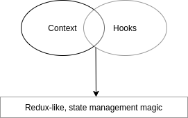
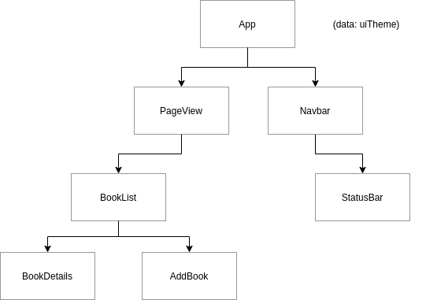
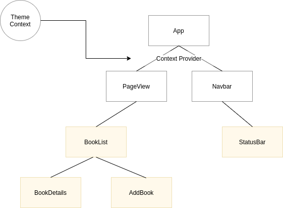

# React Context & Hooks

* Context API: Clean & easy way to share state between components

* Hooks: Tap into the inner workings of React in functional components



## Install react app

```sh
npx create-react-app contextapp
cd contextapp
npm start
```

## Context API

Share state within a component tree

* Context Api



* Theme context



* [When to use context](https://reactjs.org/docs/context.html#when-to-use-context)

Context provides a way to pass data through the component tree without having to pass props down manually at every level.

In a typical React application, data is passed top-down (parent to child) via props, but this can be cumbersome for certain types of props (e.g. locale preference, UI theme) that are required ny many components within an application. Context provides a way to share value like these between components without having to explicitly pass a prop through every level of the tree.

## Adding a Context & Provider

## Accessing Context (part 1)

## Accessing Context (part 2)

## Updating Context Data